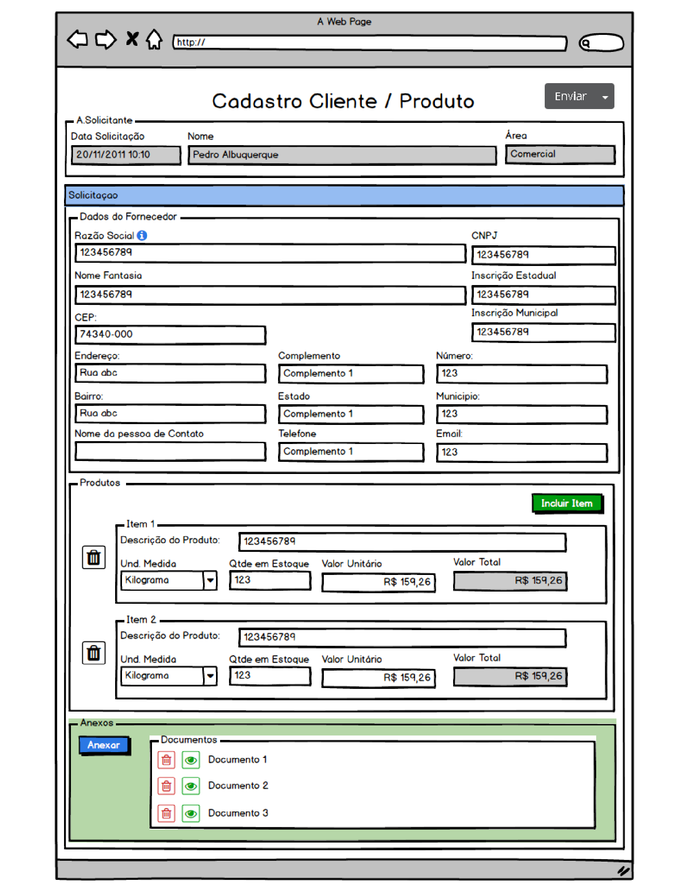
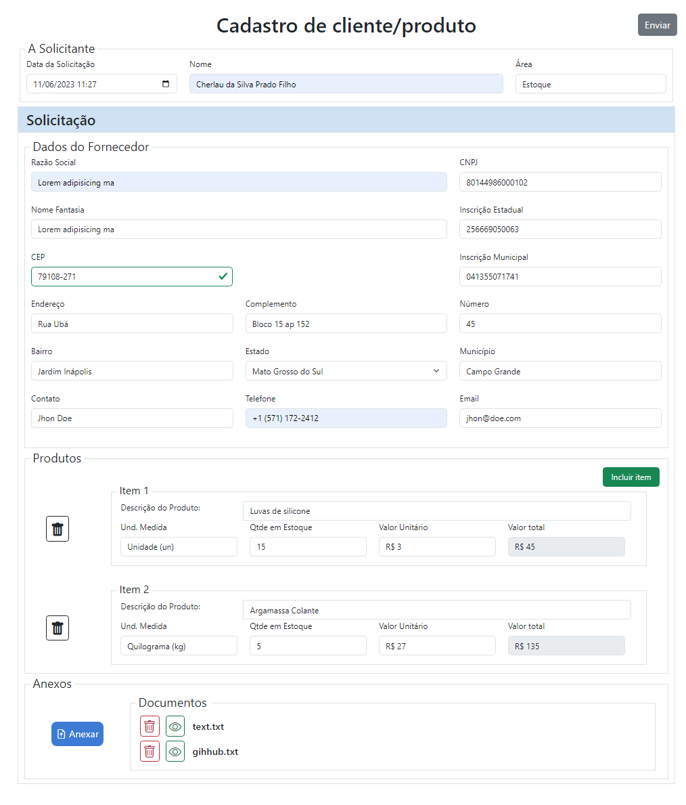
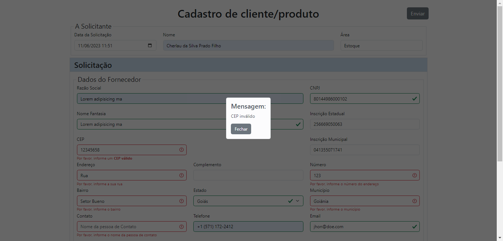
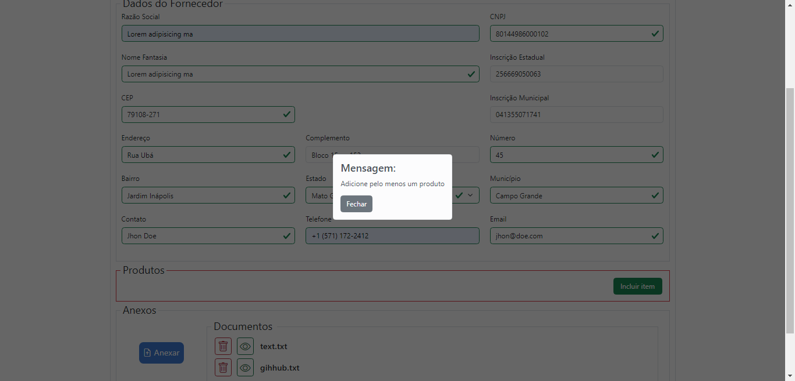
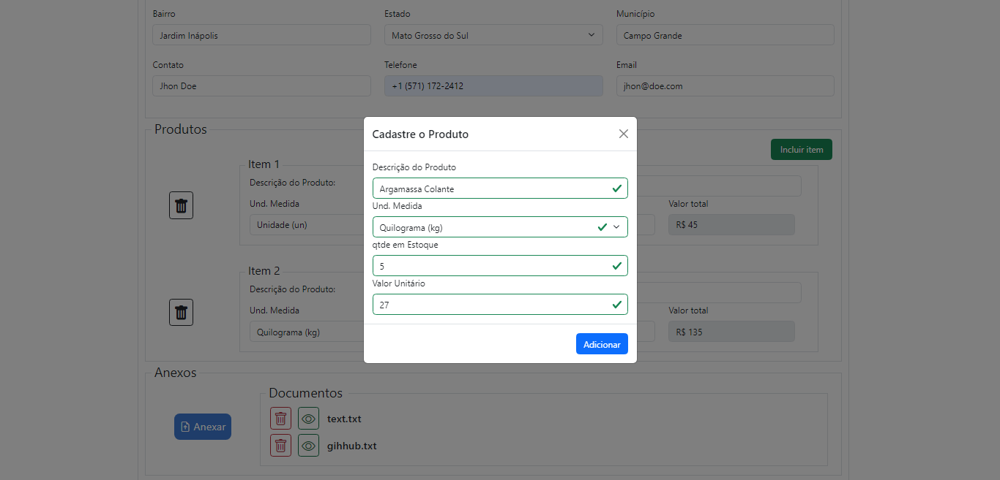
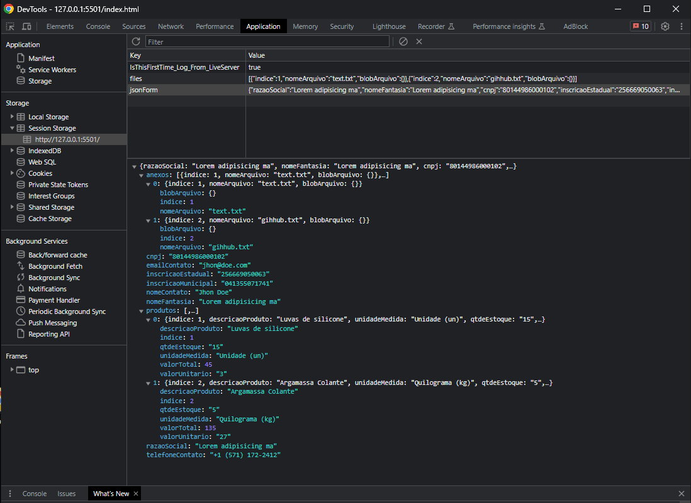

<h1 align="center">Frontend Challenge 🚀</h1>

<p align="center">
 <a href="#-sobre">Sobre</a> •
 <a href="#-projetos">Projeto</a> •
 <a href="#%EF%B8%8F-autor">Autor</a>
</p>

<h3 align="center">


</h3>

## 💻 Sobre

<strong>Projeto feito no processo seletivo para estágio</strong>. Desenvolvimento de formulário de cadastro de fornecedor/produto e documentos, possui funcionalidades como consultar CEP automaticamente usando API, cadastro de produtos que são adicionados ao carrinho e podem ser removidos, cadastro de documentos que podem ser removidos e baixados. Ao enviar o formulário, os dados são salvos em formato JSON e armazenados na session storage.

## Requisitos

* Prototipo
   * 

* Razão social obrigatório
* Nome Fantasia obrigatório
* CNPJ obrigatório
* Inscrição Estadual opcional
* Inscrição Municipal opcional
* Endereço obrigatório (consultar CEP automaticamente usando api via cep)
* Nome da pessoa de contato/telefone/email obrigatório
* Tabela de produtos: obrigatório a inclusão de pelo menos 1 item
   * Descrição obrigatório
   * Unidade de medida obrigatório
   * Valor unitário obrigatório
   * Valor total bloqueado, sendo ele a multiplicação entre quantidade em estoque e valor unitário
* Tabela de Anexos: obrigatório a inclusão de ao menos um documento
   * Os documentos anexados deverão ser armazenados em memória (blob e session storage) para envio 
   * Botão Excluir (lixeira): Ao excluir o documento, o mesmo deverá ser excluido da memória
   * Botão Visualizar (olho): Ao visualizar o documento, o mesmo deverá realizar o donwload do documento
* Botão ‘Enviar’: ao clicar no botão, deverá ser aberto modal de loading de envio, e deverá ser formatado um JSON com os dados a serem enviados, conforme exemplo:

<p>&nbsp;</p> 

```bash 
{	razaoSocial: 'Razao social',
	nomeFantasia: 'Nome Fantasia',
	cnpj: '123456',
	inscricaoEstadual: '123456',
	inscricaoMunicipal: '123456',
	nomeContato: 'Nome contato',
	telefoneContato: '+5562999999999999'
	emailContato: 'email@email.com',
	produtos: {
		[ 	indice: 1,
			descricaoProduto: 'Descrição produto',
			unidadeMedida: 'unidadeMedida',
			qtdeEstoque: '123',
			valorUnitario: '1554.00',
			valorTotal: '2555.00'		
		],
		[ 	indice: 2,
			descricaoProduto: 'Descrição produto',
			unidadeMedida: 'unidadeMedida',
			qtdeEstoque: '123',
			valorUnitario: '1554.00',
			valorTotal: '2555.00'		
		],
	}
	anexos: {
		[ 	indice: 1,
			nomeArquivo: 'iouahsiuahusihausihiahiuah',
			blobArquivo: 'iouahsiuahusihausihiahiuah'
		],
		[ 	indice: 2,
			nomeArquivo: 'iouahsiuahusihausihiahiuah',
			blobArquivo: 'iouahsiuahusihausihiahiuah'
		],	
	}

}
```
---

## 🚧 Projeto

<h3 align="center">Formulário de cadastro
  <p></p>
  
  	
  	
  	
</h3>

<p>&nbsp;</p>

<h3 align="center">JSON com os dados do formulário
  <p></p>
  
</h3>

---

## ✒️ Autor

| [ <br> <sub> Cherlau Prado </sub>](https://github.com/cherPrado) |
| :--------------------------------------------------------------------------------------------------------------------------------------------: |

<h2 >Entre em contato 🤙🏽</h2>

<div align="center">
<a href="https://www.linkedin.com/in/cherlau-prado/" target="_blank"></a>
<a href="cherlaufilho@discente.ufg.br" target="_blank"></a>
</div>


